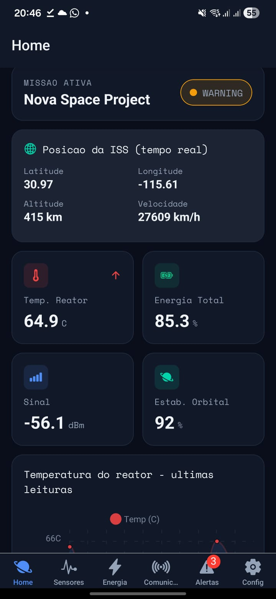
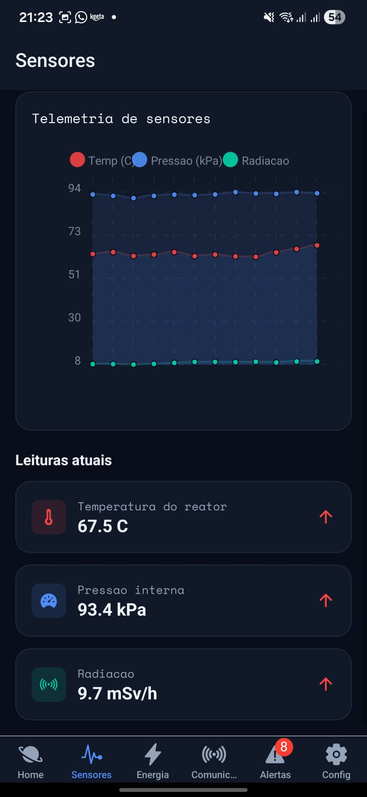
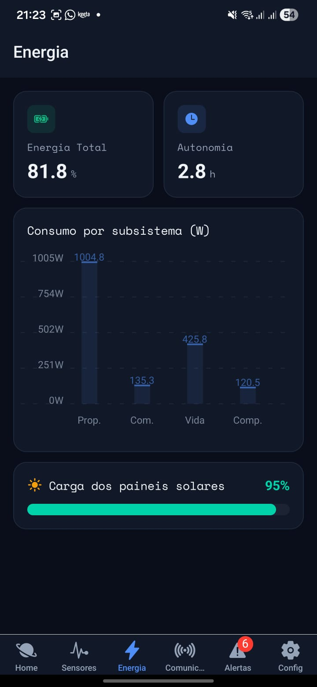
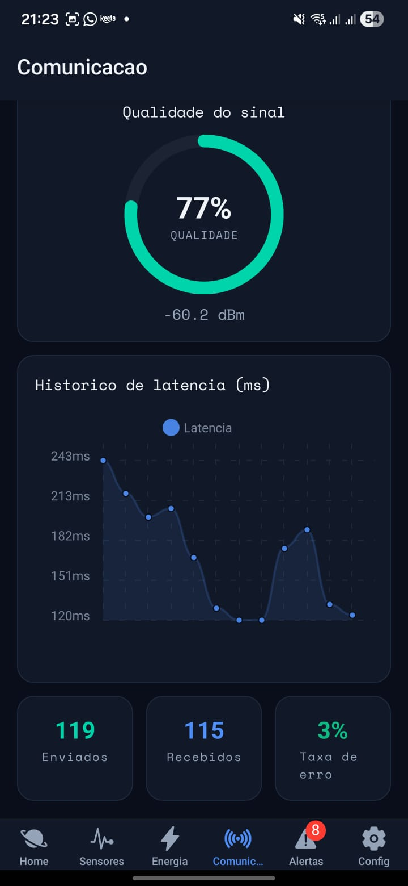
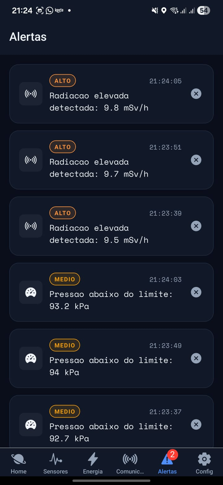
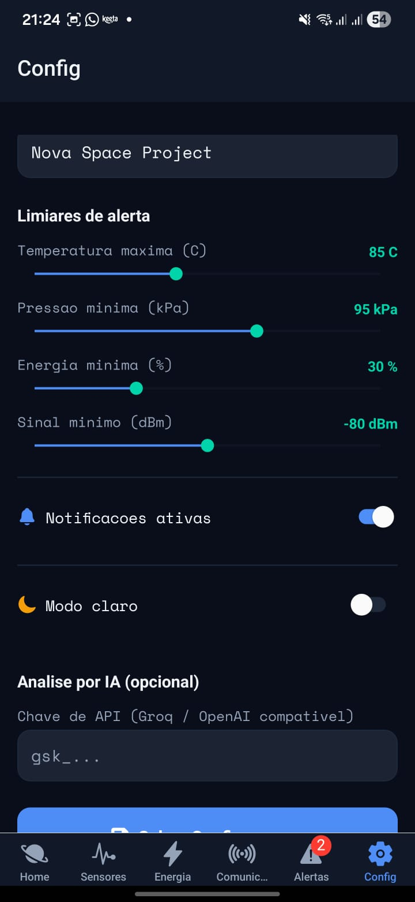

# 🛰️ OrbitWatch

### Plataforma de Análise Preditiva Espacial — Global Solution 2026.1 (FIAP)
**Disciplina:** Cross-Platform Application Development

---

## 📖 Descrição

OrbitWatch é um aplicativo mobile que simula uma central de monitoramento de missões espaciais.
Ele reúne dashboards em tempo real para sensores, energia e comunicação, gera alertas
automáticos quando limiares críticos são ultrapassados e aplica algoritmos preditivos simples para
estimar estabilidade orbital e autonomia. O tema visual é inspirado em centros de controle da NASA
e da SpaceX, com modo escuro como padrão e integração com dados reais da ISS e análise por IA generativa.

---

## 👥 Integrantes

| Nome Complet   | RM        |
|----------------|-----------|
| Gustavo Rossi  | RM566075  |
| Pedro Lima     | RM565461  |

---

## 📱 Telas do Aplicativo

### Home (Dashboard Principal)


Status geral da missão, 4 métricas-chave, mini gráfico de temperatura e posição real da ISS via API externa.

### Sensores

Gráfico de linha com três séries (temperatura, pressão, radiação) e indicadores de tendência por leitura.

### Energia

Consumo por subsistema em gráfico de barras, carga dos painéis solares e estimativa de autonomia em horas.

### Comunicação

Latência em tempo real, gauge SVG de qualidade do sinal, status do link de telemetria e taxa de erro de pacotes.

### Alertas

Lista ordenada por criticidade e tempo, badges coloridos por nível e botão para dispensar cada alerta.

### Configurações

Formulário controlado com validação: nome da missão, limiares ajustáveis, notificações, tema e chave de API da IA.

---

## ✅ Funcionalidades

- [x] Navegação com Expo Router (Tabs na raiz + Stack aninhada `/mission/[id]`)
- [x] Ícones do `@expo/vector-icons` em todas as abas
- [x] 4 dashboards com dados simulados atualizando a cada 2s (`setInterval`)
- [x] Home: 4 MetricCards, status geral e mini gráfico de temperatura
- [x] Sensores: gráfico multi-série + tendências (↑↓)
- [x] Energia: gráfico de barras, barra de progresso solar e autonomia
- [x] Comunicação: latência, gauge SVG de sinal, status do link e taxa de erro
- [x] Gerenciamento de estado com Context API + `useReducer`
- [x] Context consumido em mais de 4 telas
- [x] Persistência com AsyncStorage (limiares, missão, alertas, preferências)
- [x] Carregamento do estado persistido no `useEffect` do Provider
- [x] Formulário com validação inline e feedback de sucesso
- [x] Sistema de alertas por limiares com níveis de criticidade
- [x] Contador de alertas não lidos no ícone da aba
- [x] Tema dark espacial + toggle para light mode
- [x] Animações `Animated` (fade + slide) nos cards
- [x] Layout responsivo com `Dimensions`
- [x] TypeScript estrito, sem `any` explícito, com JSDoc
- [x] `.gitignore` correto e logs protegidos por `__DEV__`
- [x] **Diferencial:** API externa da ISS (`api.wheretheiss.at`) com fallback offline
- [x] **Diferencial:** Notificações locais (`expo-notifications`) em alertas críticos
- [x] **Diferencial:** Análise por IA generativa (tela `/ai` com chave de API configurável)

---

## Tecnologias

- **React Native** + **Expo** (SDK 52) + **TypeScript**
- **Expo Router** — roteamento baseado em arquivos
- **Context API** + `useReducer` — estado global
- **AsyncStorage** — persistência local
- **react-native-chart-kit** + **react-native-svg** — gráficos e gauges
- **expo-notifications** — notificações locais
- **@expo/vector-icons** (Ionicons) — ícones
- **@expo-google-fonts/space-mono** — tipografia
- **@react-native-community/slider** — controles de limiar

---

## Como Executar

```bash
# 1. Clonar o repositório
git clone <url-do-repositorio>
cd orbitwatch

# 2. Instalar as dependências
npm install

# 3. (Opcional) Alinhar versões nativas com o SDK do Expo
npx expo install expo-asset
npx expo install --fix

# 4. Iniciar o projeto
npx expo start
```

Em seguida, escaneie o QR Code com o app **Expo Go** (Android/iOS) ou pressione `a` para abrir em um emulador.

## Vídeo de Demonstração
 
**Link do vídeo:** _[inserir link do YouTube/Drive aqui]_
 
## 📄 Licença
 
Projeto acadêmico desenvolvido para a **FIAP** — Global Solution 2026.1.
Uso restrito a fins educacionais.
